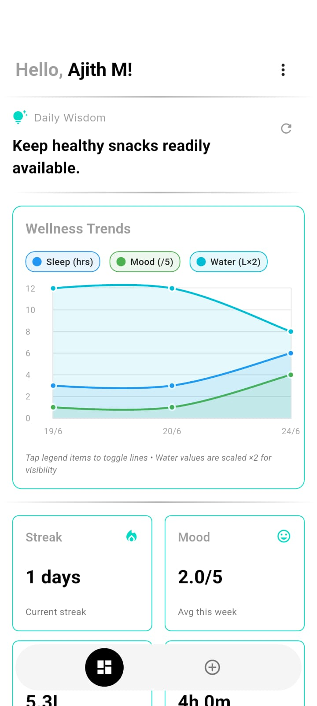
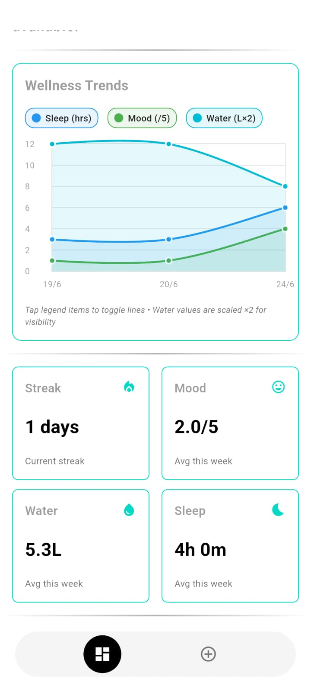
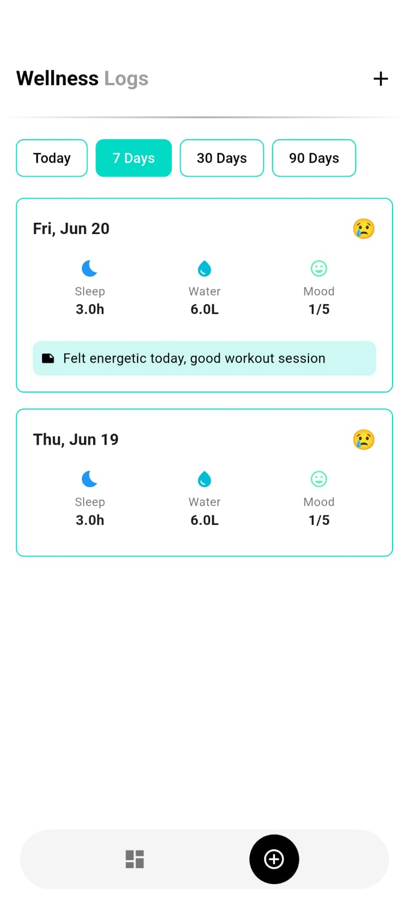
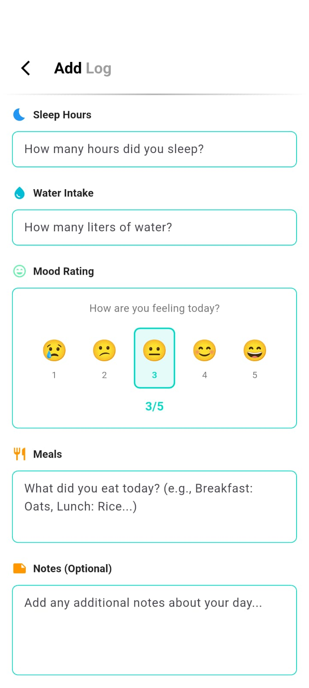
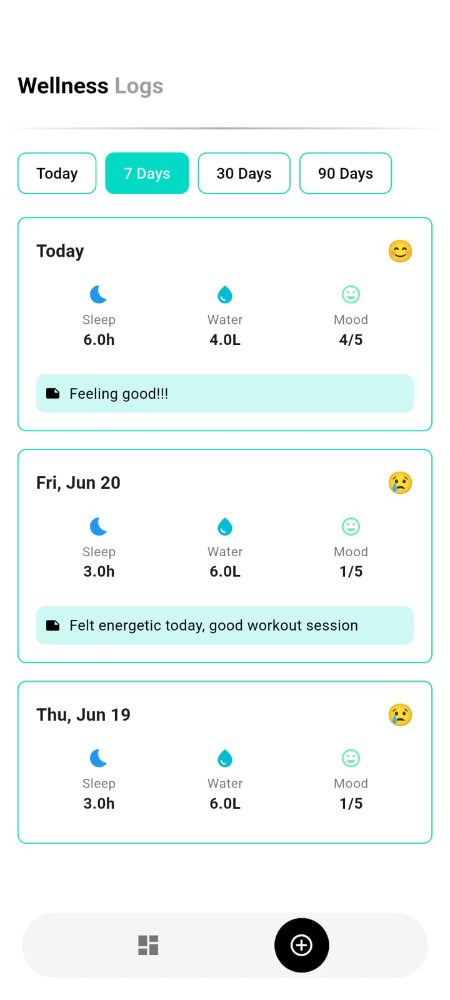
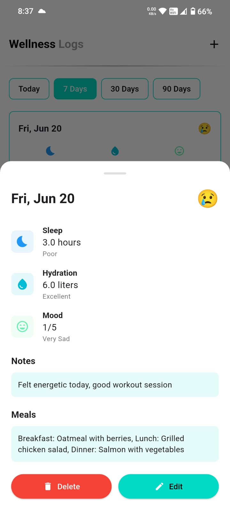

# 🌟 SAIBYA Daily - Wellness Tracker Application

## 📱 Overview

SAIBYA Daily is a comprehensive wellness tracking application that helps users monitor their daily health metrics. Built with Flutter for cross-platform mobile experience and FastAPI for a robust backend, it features OTP-based authentication and intuitive wellness logging.

  <table>
    <tr>
      <td></td>
      <td></td>
      <td></td>
      <td></td>
      <td></td>
      <td></td>
    </tr>
  </table>

## 🎥 Demo Video

  

## ✨ Key Features

### 🔐 Secure Authentication
- **Phone-based OTP verification** using Twilio
- **JWT token authentication** for API security
- **No passwords** - enhanced security and user experience

### 📊 Comprehensive Wellness Tracking
- **Sleep Hours** - Track your daily sleep patterns
- **Mood Rating** - Monitor emotional wellbeing (1-5 scale)
- **Hydration** - Log daily water intake in liters
- **Meals** - Record your daily nutrition
- **Notes** - Add personal observations

### 📈 Insightful Analytics
- **Weekly Statistics** - Visual representation of your wellness data
- **Streak Tracking** - Stay motivated with consecutive day counts
- **Progress Indicators** - See how you're doing against goals
- **Health Tips** - Daily wellness recommendations

## 🛠️ Technical Stack

<table>
  <tr>
    <td align="center" width="50%">
      <h3>Frontend</h3>
        
      Cross-platform mobile framework
        
      <a href="https://github.com/ajith-m-doodlebug/saibya_daily_flutter">
        📱 View Frontend Repository
      </a>
    </td>
    <td align="center" width="50%">
      <h3>Backend</h3>
        
      Modern Python web framework
        
      <a href="https://github.com/ajith-m-doodlebug/saibya_daily_backend">
        🚀 View Backend Repository
      </a>
    </td>
  </tr>
</table>
